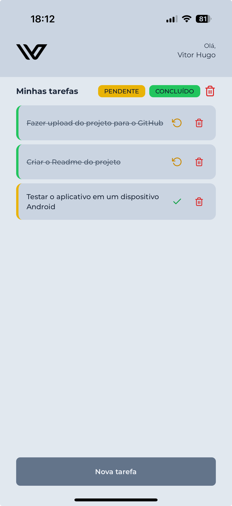

# 📱 Task Manager App

Um aplicativo de gerenciamento de tarefas desenvolvido com React Native e Expo, oferecendo uma interface intuitiva para organizar suas atividades diárias.

## 🚀 Funcionalidades

- ✅ Criar novas tarefas
- 📝 Marcar tarefas como concluídas ou pendentes
- 🗑️ Excluir tarefas individualmente
- 🧹 Limpar todas as tarefas concluídas de uma vez
- 🔍 Filtrar tarefas por status (Pendente/Concluído)
- 💾 Persistência de dados local

## 🛠️ Tecnologias Utilizadas

- **[Expo](https://expo.dev/)** - Framework para desenvolvimento React Native
- **[React Native](https://reactnative.dev/)** - Framework para desenvolvimento mobile
- **[TypeScript](https://www.typescriptlang.org/)** - Superset JavaScript com tipagem estática
- **[AsyncStorage](https://react-native-async-storage.github.io/async-storage/)** - Armazenamento local persistente
- **[React Native Toast Message](https://github.com/calintamas/react-native-toast-message)** - Notificações toast elegantes
- **[Expo Blur](https://docs.expo.dev/versions/latest/sdk/blur-view/)** - Efeitos de blur para modais
- **[NativeWind](https://www.nativewind.dev/)** - Tailwind CSS para React Native
- **[Expo Vector Icons](https://icons.expo.fyi/)** - Biblioteca de ícones

## 📦 Componentes Principais

- **FlatList** - Lista otimizada para renderização das tarefas
- **Header** - Componente de cabeçalho reutilizável
- **CardTask** - Card individual para cada tarefa
- **Button** - Componente de botão customizado
- **Input** - Componente de entrada de texto
- **Modal** - Modal customizado com efeito blur
- **StatusButton** - Botões de filtro por status

## 🎯 Pré-requisitos

Antes de começar, você vai precisar ter instalado em sua máquina:

- [Node.js](https://nodejs.org/) (versão 16 ou superior)
- [npm](https://www.npmjs.com/) ou [Yarn](https://yarnpkg.com/)
- [Expo CLI](https://docs.expo.dev/get-started/installation/)
- [iOS Simulator](https://docs.expo.dev/workflow/ios-simulator/) (para macOS) ou [Android Studio](https://docs.expo.dev/workflow/android-studio-emulator/) (para Android)

## 🔧 Instalação e Execução

1. **Clone o repositório**

```bash
git clone https://github.com/vitorhugomarcal/vertem.git
cd vertem
```

2. **Instale as dependências**

```bash
npm install
```

3. **Inicie o projeto**
   Para iOS:

```bash
npx expo run:ios
```

Para iOS:

```bash
npx expo run:android
```

Para iniciar o servidor de desenvolvimento:

```bash
npx expo start
```

## 📱 Estrutura do Projeto

- **`src/`** - Código fonte da aplicação
  - **`components/`** - Componentes reutilizáveis
    - **`Button/`** - Componente de botão customizado
    - **`CardTask/`** - Card para exibição de tarefas
    - **`Header/`** - Cabeçalho da aplicação
    - **`Input/`** - Campo de entrada de texto
    - **`Modal/`** - Modal com efeito blur
    - **`StatusButton/`** - Botões de filtro por status
  - **`dtos/`** - Data Transfer Objects (tipos TypeScript)
  - **`storage/`** - Funções para persistência de dados
  - **`screens/`** - Telas da aplicação
- **`assets/`** - Recursos estáticos (imagens, ícones)

## 🎨 Screenshots

<p align="center">
  
</p>

## 🤝 Contribuindo

1. Faça um fork do projeto
2. Crie uma branch para sua feature (git checkout -b feature/AmazingFeature)
3. Commit suas mudanças (git commit -m 'Add some AmazingFeature')
4. Push para a branch (git push origin feature/AmazingFeature)
5. Abra um Pull Request

## 📄 Licença

Este projeto está sob a licença MIT. Veja o arquivo LICENSE para mais detalhes.

## 👨‍💻 Autor

Vitor Hugo Marçal

⭐️ Se este projeto te ajudou, considere dar uma estrela!
